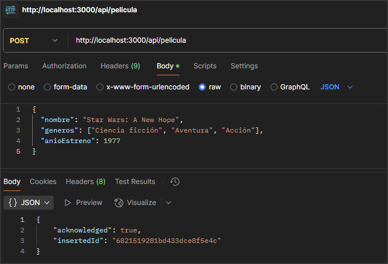
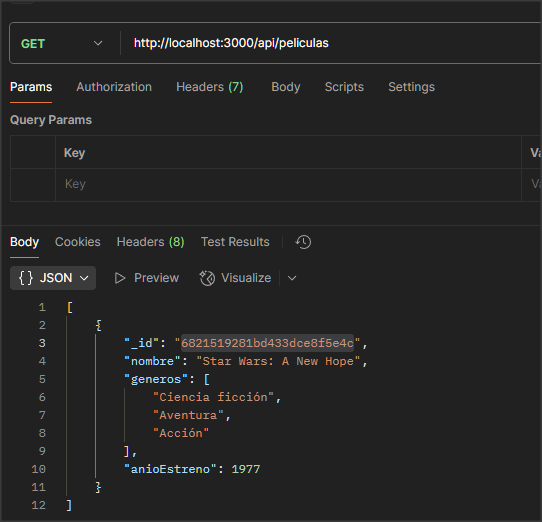
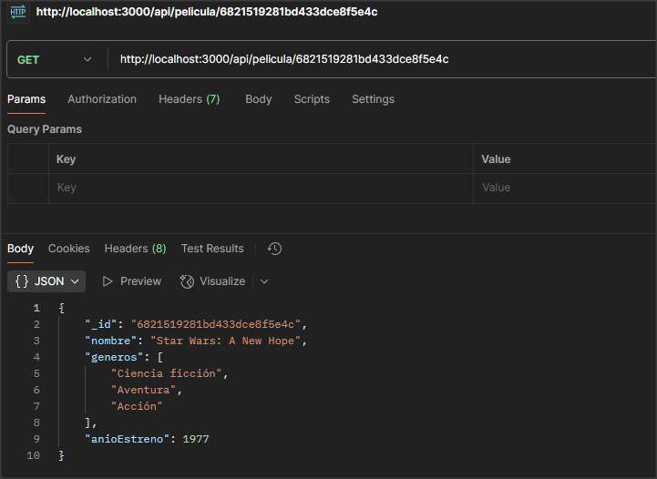
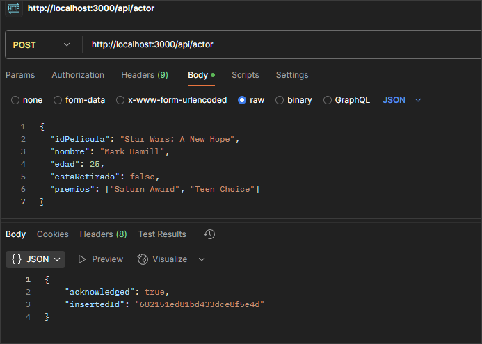
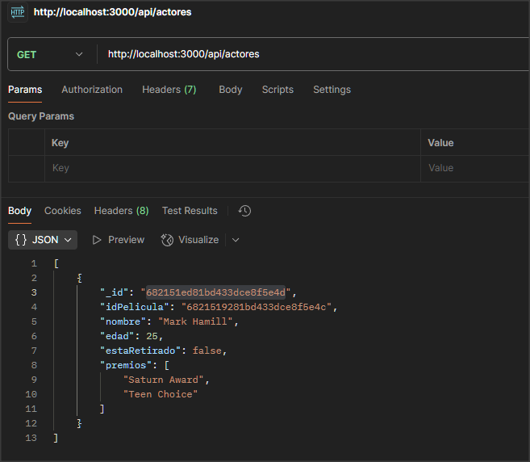
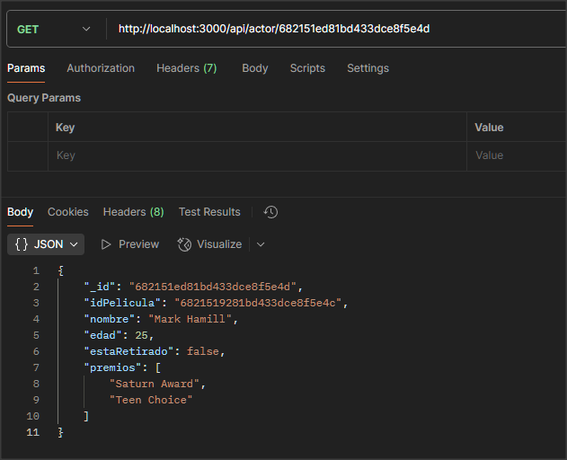
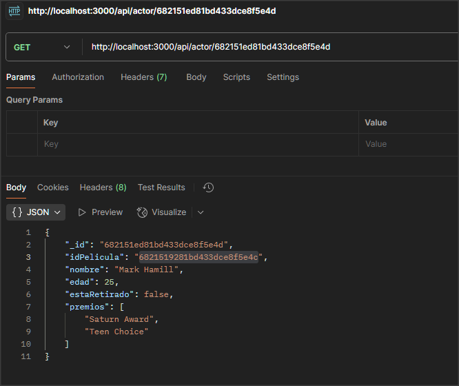

# 🎬 API REST Cine - IPLACEX

Proyecto desarrollado como parte del taller de la **Unidad III** de la asignatura **Programación Web Services**.  
El objetivo es implementar una **API REST utilizando Node.js, Express y MongoDB Atlas** para gestionar películas favoritas y sus actores.

---

## 📦 Tecnologías utilizadas

- Node.js + Express
- MongoDB Atlas (Cloud)
- MongoDB Driver
- CORS
- JavaScript (ESModules)
- Postman (para pruebas)

---

## 📁 Estructura del Proyecto

```
cine-api/
├── server.js
├── package.json
└── src/
    ├── common/
    │   └── db.js
    ├── pelicula/
    │   ├── pelicula.js
    │   ├── controller.js
    │   └── routes.js
    └── actor/
        ├── actor.js
        ├── controller.js
        └── routes.js
```

---

## ⚙️ Instalación y ejecución

1. Clonar el repositorio:

```bash
git clone .
cd cine-api
```

2. Instalar dependencias:

```bash
npm install
```

3. Ejecutar el servidor:

```bash
npm start
```

🖥️ Resultado esperado:

```
[MongoDB] Connected to Atlas successfully.
[Express] Server running at http://localhost:3000
```

> 

---

## 🔗 Endpoints disponibles

### 🎬 Películas

#### POST `/api/pelicula`
Agregar una nueva película.

- Método: `POST`
- URL: `http://localhost:3000/api/pelicula`
- Body (JSON):
```json
{
  "nombre": "Star Wars: A New Hope",
  "generos": ["Ciencia ficción", "Aventura"],
  "anioEstreno": 1977
}
```

> 

---

#### GET `/api/peliculas`
Obtener todas las películas.

- URL: `http://localhost:3000/api/peliculas`

> 

---

#### GET `/api/pelicula/:id`
Obtener una película por ID.

- Ejemplo: `http://localhost:3000/api/pelicula/6821519281bd433dce8f5e4c`

> 

---

#### PUT `/api/pelicula/:id`
Actualizar una película por su ID.

- Método: `PUT`
- URL: `http://localhost:3000/api/pelicula/6821519281bd433dce8f5e4c`
- Body (JSON):
```json
{
  "nombre": "Star Wars: The Empire Strikes Back",
  "generos": ["Ciencia ficción", "Aventura", "Drama"],
  "anioEstreno": 1980
}
```

---

#### DELETE `/api/pelicula/:id`
Eliminar una película por su ID.

- Método: `DELETE`
- URL: `http://localhost:3000/api/pelicula/6821519281bd433dce8f5e4c`

---

### 🎭 Actores

#### POST `/api/actor`
Agregar un nuevo actor a una película (por nombre).

- URL: `http://localhost:3000/api/actor`
- Body (JSON):
```json
{
  "idPelicula": "Star Wars: A New Hope",
  "nombre": "Mark Hamill",
  "edad": 25,
  "estaRetirado": false,
  "premios": ["Saturn Award", "Teen Choice"]
}
```

> 

---

#### GET `/api/actores`
Obtener todos los actores.

- URL: `http://localhost:3000/api/actores`

> 

---

#### GET `/api/actor/:id`
Obtener un actor por ID.

- Ejemplo: `http://localhost:3000/api/actor/682151ed81bd433dce8f5e4d`

> 

---

#### GET `/api/actor/pelicula/:peliculaId`
Obtener todos los actores que pertenecen a una película.

- Ejemplo: `http://localhost:3000/api/actor/pelicula/6821519281bd433dce8f5e4c`

> 

---

#### PUT & DELETE (no implementados)
Este proyecto contempla solo lectura e inserción de actores.  
La edición o eliminación de actores podría ser implementada en versiones futuras.

---

## 📌 Consideraciones adicionales

- El servidor no se inicia si no se logra conexión con MongoDB Atlas.
- Se usan códigos de estado HTTP adecuados: 201, 200, 400, 404, 500.
- El proyecto puede ser probado directamente con Postman o herramientas similares.
- El nombre de la película debe existir previamente para poder asignarle actores.

---

## 📝 Autor

**Edinson Ahumada**  
Proyecto para IPLACEX - Programación Web Services  
Licencia Apache
